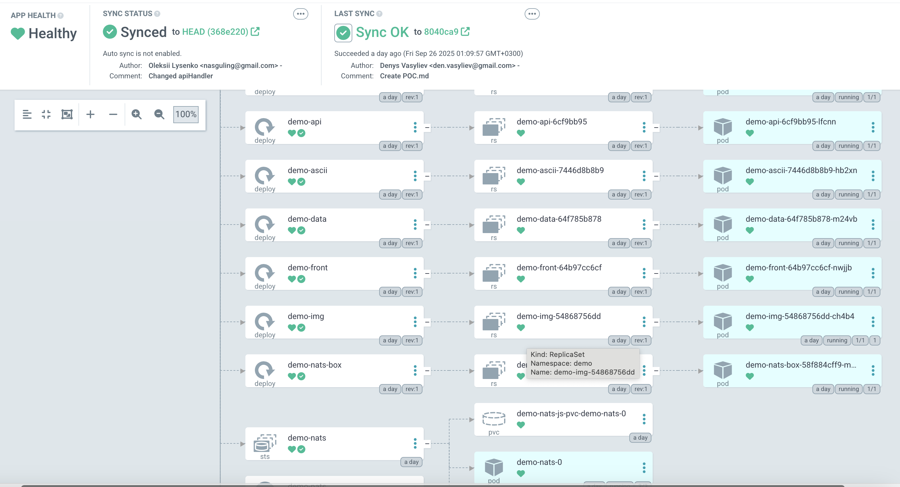

# MVP Demo

This document walks you through a quick demo of our **MVP setup**.  
It outlines the key steps you need to get started:

- Open the application  
- Upload a sample image  
- Observe the app update automatically after a change is deployed  

**To run the application, use:**

```bash
kubectl port-forward -n demo svc/ambassador 8081:80&
```
Next, verify the status:

```bash
curl localhost:8081
```

The output is:

```
k8sdiy-api:599e1af% 
```

Then, run the command to upload our image:

```bash
curl -F 'image=@devops.png' localhost:8081/img/
```

And we can see the result:
 

To demonstrate automatic synchronization, we create a new commit. After refreshing in ArgoCD, you can see that our new commit is synchronized and deployed.
 

Demo: 
[](https://www.youtube.com/watch?v=wZo1PcxlgEo)

