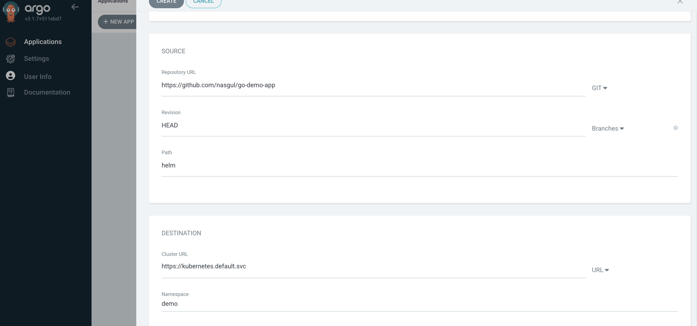

# Proof of Concept.

-----

# Getting Started with Argo CD

This guide provides the steps to install and configure [ArgoCD](https://argo-cd.readthedocs.io/en/stable/) for a local development environment using **K3d**.

## Argo CD

We can read more about Argo CD by link [here](https://argo-cd.readthedocs.io/en/stable/)

  

## Requirements

  * **`kubectl`** command-line tool installed.
  * A valid **`kubeconfig`** file (default: `~/.kube/config`).
  * **`k3d`** installed and a cluster created.

## Installation with k3d

1. Create new cluster for argocd:  
```bash
$ k3d cluster create argo
... 
INFO[0029] Cluster 'argo' created successfully!         
INFO[0029] You can now use it like this: kubectl cluster-info
```

```bash
$ kubectl cluster-info
Kubernetes control plane is running at https://0.0.0.0:57142
CoreDNS is running at https://0.0.0.0:57142/api/v1/namespaces/kube-system/services/kube-dns:dns/proxy
Metrics-server is running at https://0.0.0.0:57142/api/v1/namespaces/kube-system/services/https:metrics-server:https/proxy

$ kubectl version
$ kubectl get all -A
```

2. Installation of ArgoCD 
    
```bash
$ kubectl create namespace argocd
namespace/argocd created

$ kubectl get ns
NAME              STATUS   AGE
argocd            Active   17s
default           Active   2m19s
kube-node-lease   Active   2m19s
kube-public       Active   2m19s
kube-system       Active   2m19s

$ kubectl apply -n argocd -f https://raw.githubusercontent.com/argoproj/argo-cd/stable/manifests/install.yaml

$ kubectl get all -n argocd
NAME                                                   READY   STATUS              RESTARTS   AGE
pod/argocd-application-controller-0                    0/1     ContainerCreating   0          16s
pod/argocd-applicationset-controller-88b7765bd-qd2xq   0/1     ContainerCreating   0          16s
pod/argocd-dex-server-69bb6555b7-2j8m2                 0/1     Init:0/1            0          16s
pod/argocd-notifications-controller-59c688b7f-jz7zw    0/1     ContainerCreating   0          16s
pod/argocd-redis-979886645-xdnwb                       0/1     Init:0/1            0          16s
pod/argocd-repo-server-7c4574d7b-jwbfb                 0/1     Init:0/1            0          16s
pod/argocd-server-d9f4b856-cmcgg                       0/1     ContainerCreating   0          16s

NAME                                              TYPE        CLUSTER-IP      EXTERNAL-IP   PORT(S)                      AGE
service/argocd-applicationset-controller          ClusterIP   10.43.54.172    <none>        7000/TCP,8080/TCP            17s
service/argocd-dex-server                         ClusterIP   10.43.220.82    <none>        5556/TCP,5557/TCP,5558/TCP   17s
service/argocd-metrics                            ClusterIP   10.43.62.125    <none>        8082/TCP                     17s
service/argocd-notifications-controller-metrics   ClusterIP   10.43.71.142    <none>        9001/TCP                     17s
service/argocd-redis                              ClusterIP   10.43.164.198   <none>        6379/TCP                     17s
service/argocd-repo-server                        ClusterIP   10.43.51.162    <none>        8081/TCP,8084/TCP            17s
service/argocd-server                             ClusterIP   10.43.134.61    <none>        80/TCP,443/TCP               16s
service/argocd-server-metrics                     ClusterIP   10.43.111.26    <none>        8083/TCP                     16s

NAME                                               READY   UP-TO-DATE   AVAILABLE   AGE
deployment.apps/argocd-applicationset-controller   0/1     1            0           16s
deployment.apps/argocd-dex-server                  0/1     1            0           16s
deployment.apps/argocd-notifications-controller    0/1     1            0           16s
deployment.apps/argocd-redis                       0/1     1            0           16s
deployment.apps/argocd-repo-server                 0/1     1            0           16s
deployment.apps/argocd-server                      0/1     1            0           16s

NAME                                                         DESIRED   CURRENT   READY   AGE
replicaset.apps/argocd-applicationset-controller-88b7765bd   1         1         0       16s
replicaset.apps/argocd-dex-server-69bb6555b7                 1         1         0       16s
replicaset.apps/argocd-notifications-controller-59c688b7f    1         1         0       16s
replicaset.apps/argocd-redis-979886645                       1         1         0       16s
replicaset.apps/argocd-repo-server-7c4574d7b                 1         1         0       16s
replicaset.apps/argocd-server-d9f4b856                       1         1         0       16s

NAME                                             READY   AGE
statefulset.apps/argocd-application-controller   0/1     16s

# checked statuses
$ k get pod -n argocd -w
NAME                                               READY   STATUS            RESTARTS   AGE
argocd-application-controller-0                    0/1     Running           0          36s
argocd-applicationset-controller-88b7765bd-qd2xq   1/1     Running           0          36s
argocd-dex-server-69bb6555b7-2j8m2                 0/1     PodInitializing   0          36s
argocd-notifications-controller-59c688b7f-jz7zw    1/1     Running           0          36s
argocd-redis-979886645-xdnwb                       0/1     PodInitializing   0          36s
argocd-repo-server-7c4574d7b-jwbfb                 0/1     Running           0          36s
argocd-server-d9f4b856-cmcgg                       0/1     Running           0          36s
argocd-redis-979886645-xdnwb                       1/1     Running           0          37s
argocd-repo-server-7c4574d7b-jwbfb                 1/1     Running           0          41s
argocd-application-controller-0                    1/1     Running           0          41s
argocd-dex-server-69bb6555b7-2j8m2                 1/1     Running           0          49s
```
3. Get access to ArgoCD with Port Forwarding 
```bash
$ kubectl port-forward svc/argocd-server -n argocd 8080:443&
[1] 23820
Forwarding from 127.0.0.1:8080 -> 8080
Forwarding from [::1]:8080 -> 8080
Handling connection for 8080
```

4. Get password

```bash               
$ kubectl -n argocd get secret argocd-initial-admin-secret -o jsonpath="{.data.password}"|base64 -d;echo
```
* With this password we can login to admin panel with user `admin`.


5. Create new App
- Click `+ NEW APP` 

- Set name `demo`
- Project by default
- Sync `Manual`
- Like source we use git
- We use repo https://github.com/nasgul/go-demo-app (we have helm charts)
  
- In the `Path` we will use `helm`  
  
- Click to `CREATE`  
  

6. Переглянемо деталі розгорнутого застосунку натиснувши на нього в списку.  
Графічний інтерфейс надає ієрархічне уявлення про компоненти програми, їх розгортання та поточний стан у кластері. 

  

7. Синхронізація застосунку 
- Для цього у вікні відомостей про програму натискаємо кнопку `SYNC` 
- Праворуч вискакує вікно в якому потрібно обрати компоненти та режими синхронізації та натиснути кнопку `SYNCHRONIZE`  
- Після завершення процесу можемо перевірити правильність розгортання програми, перевіривши її статус у кластері:  

  

8. Прослідкуємо за реакцією ArgoCD на зміни в репозиторію.
- Змінимо в файлі репозиторію https://github.com/vit-um/go-demo-app/blob/master/helm/values.yaml тип шлюзу з `NodePort` на `LoadBalancer` (останній рядок файлу)  


```bath
$ k get svc -n demo
NAME               TYPE        CLUSTER-IP      EXTERNAL-IP   PORT(S)                                                 AGE
demo-nats          ClusterIP   None            <none>        4222/TCP,6222/TCP,8222/TCP,7777/TCP,7422/TCP,7522/TCP   31m
demo-front         ClusterIP   10.43.247.92    <none>        80/TCP                                                  31m
cache              ClusterIP   10.43.234.48    <none>        6379/TCP                                                31m
ambassador         NodePort    10.43.190.212   <none>        80:30092/TCP                                            31m
```
- Викликаний процес синхронізації отримає останню версію репозиторію гіт та порівняє її з поточним станом. Таким чином бачимо що тип сервісу для ambassador змінився з NodePort на LoadBalancer та відповідно був оновлений маніфест Kubernetes
```bath
$ NAME               TYPE           CLUSTER-IP      EXTERNAL-IP   PORT(S)             AGE
ambassador         LoadBalancer   10.43.190.212   <pending>     80:30092/TCP          35m
```